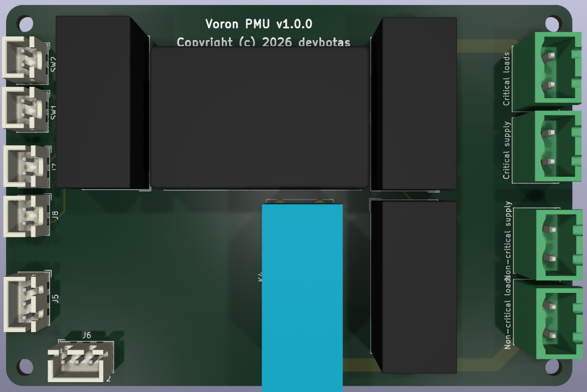
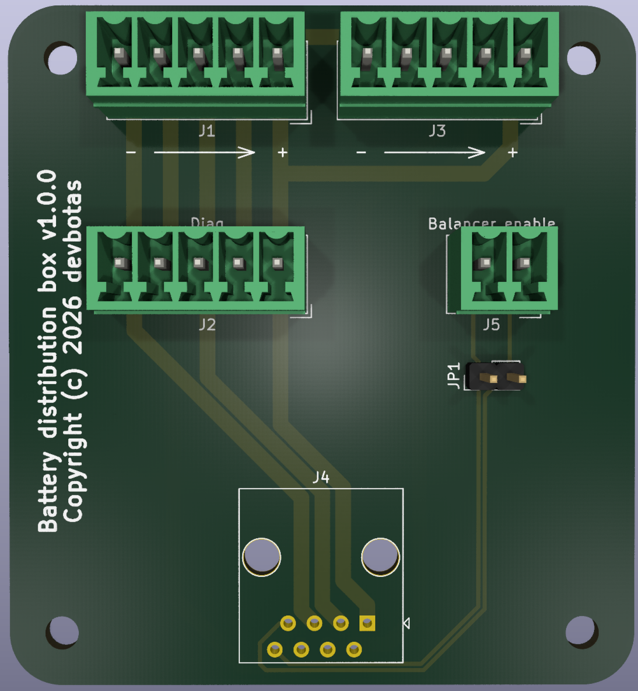

Since KiCad has no package management, I'm trying out a monorepo approach.

# Voron PMU

## The problem

Loss of power. Smaller printers can be powered through a UPS, however, this hardly works for more power hungry ones, especially with chamber heaters. They would require massive and expensive UPSes that make no sense for a casual printer hobbyist.

Very ofthen, though, power loss is short-lived: 10 minutes (when one, for example, accidentally disengages the wrong circuit breaker).

There are a few sides of this problem:

1. Printer loses calibration and positional data;
2. Printhead may drop down, ramming hot nozzle into the part ruining it;
3. Part cools down and pops of the buildplate.

## Solution

The solution is to split the the power lines: essential parts run on a simple UPS (Raspberry Pi, controller boards, motors), while heaters get the power directly from the mains. When power loss occurs, this PMU board detects it, and trigger Klipper macroses which pause the print, park the printhead to a safe position and waits for the power to be restored. Once power is back, another set of macroses unsure proper printing temperatures and resumes the print.

## Other features

Soft on/off: once plugged into the mains, printer will start in "Standby" mode, waiting for user to press the Power On button. This is more relevant to printfarms, where restoring power to a large amount of devices at once may trigger a huge mains inrush current, tripping the main breaker.

Power Off button can also be connected, acting also as an Emergency Stop.

# Battery distribution box

## The problem

Batteries are heavy. When DIY'ing a battery bank, this is an issue, because entire battery quickly becomes too heavy for a single person to move around. For example, a single EVE 280Ah cell weights 5kg+; a 48V system would weight more than 80kg. I dislike that, this is not very DIY-friendly, especially, when one has to move things around.

Ain't many options here, one has to either use smaller cells (which is less cost efficient), o split battery into smaller blocks. When splitting into blocks of 12/24V, cabling becomes a mess.

Another issue is that BMS'es rarely have serious balancers built-in; usually, it is a separate device connected in parallel to BMS. This adds to the complexity of the wiring.

Finally, there's the wiring itself. Mixing up two balancer leads may result in destroyed electronics. Connecting BMS to the battery is one of the scariest moments for me, even though I always triple check if the order of the wires is corrrect.

## Solution

An intermediate distribution box. It allows:

* Splitting battery into smaller banks and wiring them locally;
* Checking the wiring order before connecting expesinsive BMS'es and balancers;
* A convenient connection for the balancer (which is actually optional);
* A handy extra connection for diagnostic purposes.

